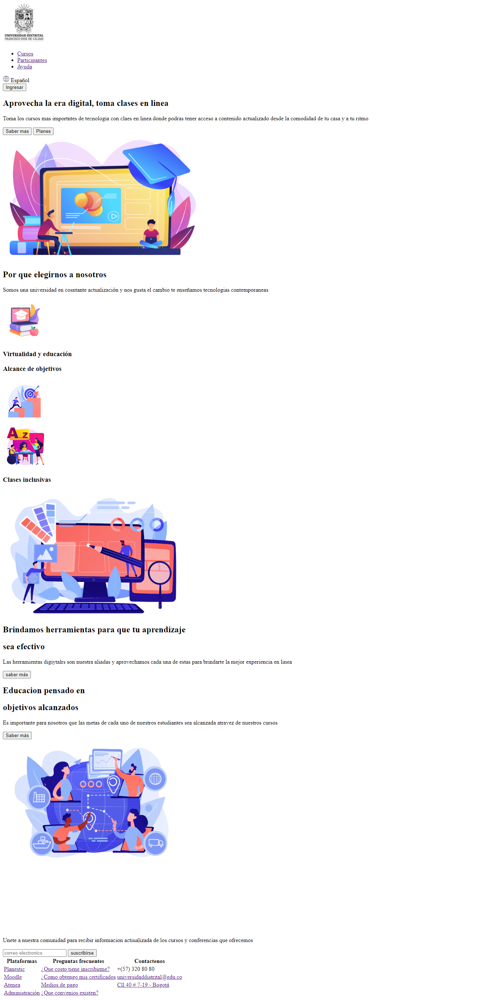

<h1>Taller 9 Jorge Andres Naranjo Peña</h1>

<h2> Información</h2>

Curso: full Stack Basico - Grupo 1

Profesor: Cristian Patiño

<h3>Link pagina web<h3>
<a href="https://andresnaranjo1.github.io/taller-9-full-stack/" target="_blank"> Link pagina web</a>

<h2> Punto 1: Link figma </h2>

<a href="https://www.figma.com/file/5qNwy1gJuFzJdc9MEjzjuB/Jorge-Andres-Naranjo-Pe%C3%B1a?type=design&node-id=0%3A1&mode=design&t=sL7zFpjswYzZxcHO-1" target="_blank">Link de Figma</a>

<h2> Punto 2: HTML</h2>

